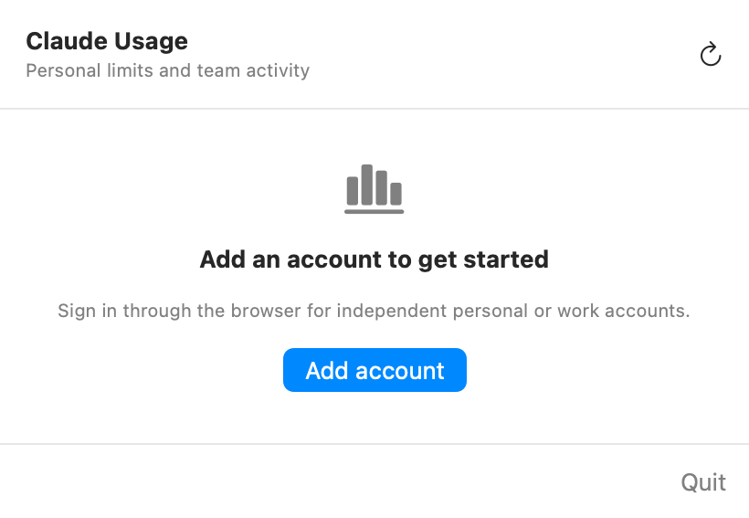
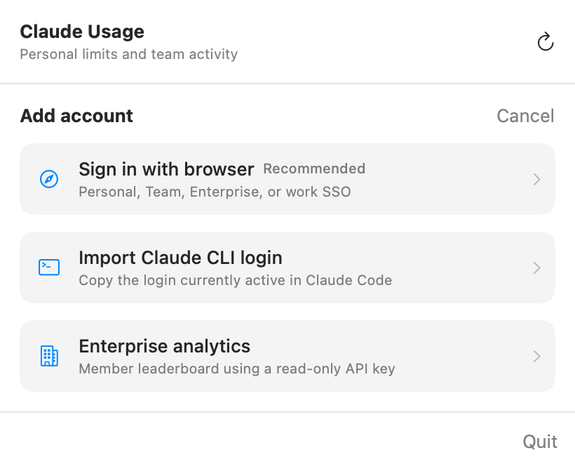
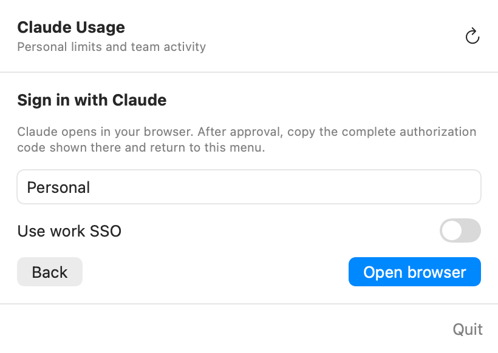
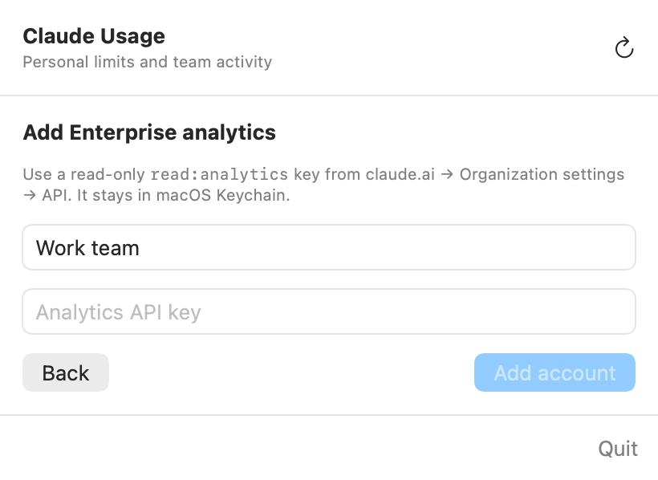

# Claude Usage for macOS

A native macOS menu-bar monitor for Claude plan limits and Enterprise team activity.

Claude Usage can keep several personal, Team, or Enterprise logins connected at the same time. Each browser login is stored independently in macOS Keychain, so shell aliases such as `claude-personal` and `claude-work` do not interfere with the monitor.

## What it shows

- Five-hour session utilization and reset time.
- Weekly utilization and reset time.
- Model-specific weekly limits when Anthropic returns them.
- Multiple personal and work accounts in one menu-bar panel.
- Enterprise member token activity over the previous seven days.
- Automatic refresh every five minutes and manual refresh on demand.

<p align="center">
  
</p>

## Requirements

- macOS 14 Sonoma or newer.
- Xcode command-line tools.
- A Claude account for personal usage monitoring.
- For the organization-wide member leaderboard: a Claude Enterprise organization and an Analytics API key with `read:analytics`.

Install the Xcode command-line tools if needed:

```sh
xcode-select --install
```

## Build and install

From the repository root:

```sh
./scripts/build-app.sh
open "dist/Claude Usage.app"
```

The build script creates and locally signs:

```text
dist/Claude Usage.app
```

To keep the app in Applications:

```sh
cp -R "dist/Claude Usage.app" /Applications/
open "/Applications/Claude Usage.app"
```

If macOS blocks the first launch, open **System Settings → Privacy & Security**, locate the blocked-app message, and choose **Open Anyway**. This is a locally built application rather than an App Store or notarized release.

### Build the installer package

The repository version is stored in [`VERSION`](VERSION). To produce the `0.0.1` installer:

```sh
./scripts/build-pkg.sh
```

The package installs Claude Usage into `/Applications` and is written to:

```text
release/ClaudeUsage-0.0.1.pkg
```

Open it locally with:

```sh
open "release/ClaudeUsage-0.0.1.pkg"
```

Without Apple Developer certificates, the app is ad-hoc signed and the installer package is unsigned. It is suitable for local testing or an open-source release where users explicitly approve it in **Privacy & Security**, but it will not pass Gatekeeper as an identified-developer release.

### Sign and notarize a public release

Public distribution requires both `Developer ID Application` and `Developer ID Installer` certificates. Pass their full Keychain identity names when building:

```sh
APP_SIGN_IDENTITY="Developer ID Application: Your Name (TEAMID)" \
INSTALLER_SIGN_IDENTITY="Developer ID Installer: Your Name (TEAMID)" \
./scripts/build-pkg.sh
```

Store notarization credentials once:

```sh
xcrun notarytool store-credentials "claude-usage-notary" \
  --apple-id "you@example.com" \
  --team-id "TEAMID" \
  --password "APP-SPECIFIC-PASSWORD"
```

Submit, wait, and staple the accepted ticket:

```sh
xcrun notarytool submit "release/ClaudeUsage-0.0.1.pkg" \
  --keychain-profile "claude-usage-notary" \
  --wait
xcrun stapler staple "release/ClaudeUsage-0.0.1.pkg"
xcrun stapler validate "release/ClaudeUsage-0.0.1.pkg"
```

Apple requires Developer ID signing, hardened runtime, secure timestamps, and notarization for a trusted direct-download release. See [Apple's notarization guide](https://developer.apple.com/documentation/security/notarizing_macos_software_before_distribution) and [custom command-line workflow](https://developer.apple.com/documentation/security/customizing-the-notarization-workflow).

### Start automatically at login

1. Move the app to `/Applications`.
2. Open **System Settings → General → Login Items & Extensions**.
3. Under **Open at Login**, click `+`.
4. Select **Claude Usage** from Applications.

## Add an account

Click the chart icon in the macOS menu bar, then select **Add account**.

<p align="center">
  
</p>

There are three connection methods:

1. **Sign in with browser** — recommended for personal accounts, Team/Enterprise seats, work SSO, and multiple simultaneous accounts.
2. **Import Claude CLI login** — copies whichever Claude Code login is active in its current configuration directory.
3. **Enterprise analytics** — adds an organization-wide member leaderboard using an admin-created read-only key.

## Browser login: personal or work account

Browser login is the recommended method because every authorization receives a separate refresh credential. It does not depend on a running Claude process, a shell alias, or `CLAUDE_CONFIG_DIR`.

1. Select **Sign in with browser**.
2. Enter a descriptive account name, such as `Personal`, `Acme Work`, or `Client Team`.
3. Enable **Use work SSO** when the account authenticates through your employer's identity provider.
4. Click **Open browser**.

<p align="center">
  
</p>

5. Complete the Claude authorization or organization SSO flow in the browser.
6. Claude displays an authorization value in this format:

   ```text
   authorization-code#login-state
   ```

7. Copy the complete value, including the `#` and the state after it.
8. Click the Claude Usage menu-bar icon again.
9. Paste the value into **Finish browser login** and click **Connect**.

Opening the browser moves focus away from the menu-bar panel, so macOS may hide the panel during step 5. The pending login is retained; reopen the menu-bar icon after authorization and the code field will still be waiting.

Repeat these steps for every personal or work account. Existing Claude Code instances may keep running—the monitor's saved browser accounts remain independent.

Anthropic's supported Claude Code login flow similarly routes Team and Enterprise users through their Claude account and organization authorization. See [Use Claude Code with your Team or Enterprise plan](https://support.claude.com/en/articles/11845131-use-claude-code-with-your-team-or-enterprise-plan).

## Import an existing Claude CLI login

Use this method when you want to copy the login currently active in Claude Code:

1. Sign the desired account into Claude Code using `/login`.
2. Open Claude Usage and choose **Add account → Import Claude CLI login**.
3. Enter an account label and click **Import**.

Claude Usage checks Claude Code's macOS Keychain credential first and falls back to:

```text
~/.claude/.credentials.json
```

If your aliases set separate `CLAUDE_CONFIG_DIR` values, the app cannot infer which alias it should inspect. Use browser login for those accounts, or make the desired alias's login the active default before importing.

## Enterprise team-member analytics

Browser/SSO login displays the signed-in member's own session and weekly limits. It does not grant organization-wide analytics.

For the team leaderboard, a Claude Enterprise Primary Owner must create an Analytics API key:

1. Sign in to `claude.ai` as the organization's Primary Owner.
2. Open **Organization settings → API**.
3. Enable analytics API access if it is not already enabled.
4. Create a key with the read-only `read:analytics` scope.
5. Copy the key when Claude displays it.
6. In Claude Usage, choose **Add account → Enterprise analytics**.
7. Enter a label, paste the key, and click **Add account**.

<p align="center">
  
</p>

The key is stored in macOS Keychain and sent only to Anthropic's API. The app queries the official `user_usage_report` endpoint for the previous seven days and ranks members by total tokens.

See Anthropic's [Analytics API documentation](https://platform.claude.com/docs/en/manage-claude/analytics-api) and [Team and Enterprise analytics guide](https://support.claude.com/en/articles/12883420-view-usage-analytics-for-team-and-enterprise-plans).

### Analytics limitations

- Programmatic organization-wide analytics are currently available for Claude Enterprise organizations. Team-plan owners can use Claude's built-in Analytics dashboard, but the equivalent organization Analytics API is not exposed for Team plans.
- Member analytics report token activity, not every member's remaining five-hour or weekly percentage.
- Team plan limits are allocated per member rather than pooled across the organization. See [What is the Team plan?](https://support.claude.com/en/articles/9266767-what-is-the-team-plan).
- Analytics data is delayed by Anthropic and may take several hours to appear.
- SSO membership alone does not grant `read:analytics`; the Primary Owner-created key is still required.

## Reading the monitor

- **Session** is the percentage used in the current five-hour window.
- **Weekly** is the percentage used in the current seven-day allocation.
- **Sonnet weekly** or **Opus weekly** appears only when the account has a separate model-specific limit.
- Blue indicates normal usage, orange appears at 70%, and red appears at 90%.
- The percentage beside the menu-bar icon is the highest active utilization among connected Claude plan accounts.
- Click the circular arrow to refresh all accounts immediately.
- Use the refresh button on an account card to refresh only that account.
- Use the trash button for inline removal confirmation. Removal deletes that account's saved Keychain credential.

## Security and privacy

- OAuth access and refresh credentials are stored in separate macOS Keychain entries for each account.
- Enterprise Analytics API keys are also stored in Keychain.
- Secrets are never written to `UserDefaults`, logs, screenshots, or the repository.
- Account metadata in `UserDefaults` contains only the account UUID, label, and account type.
- OAuth uses PKCE and validates that the pasted state belongs to the active login attempt.
- The app has no developer-operated backend; usage requests go directly from the Mac to Anthropic.

The personal-limit endpoint is used by Claude Code itself but is not part of Anthropic's documented public API. A future Claude authentication or endpoint change may require an app update.

## Troubleshooting

### The menu-bar panel closes

Opening a web browser naturally moves focus away from a menu-bar panel. Reopen the Claude Usage icon after browser authorization; the pending login is retained.

All add, delete, confirmation, and error controls inside the app are inline. They should not dismiss the panel. If an inline control still closes it, record which control and your macOS version.

### “The authorization code is invalid”

- Copy the complete value, including `#state`.
- Do not reuse a code from an older login attempt.
- If you clicked **Cancel** or restarted login, use the newest browser page and code.
- Ensure whitespace was not inserted in the middle of the copied value.

### Work SSO does not appear

- Start a new login and enable **Use work SSO** before opening the browser.
- Confirm that your email domain is assigned to the organization's identity provider.
- Complete the flow in the same browser profile that can access your work IdP.
- Ask the Claude organization administrator to confirm that your account has a seat.

### Usage does not change while Claude is running

- Confirm the monitor account matches the account used by that Claude instance.
- Shell aliases can point to separate configuration directories; connect each account with browser login instead of relying on CLI import.
- Click the account's refresh button.
- Usage reporting may lag briefly after a request.
- Remove and reconnect the account if refresh reports an authentication error.

### Enterprise analytics returns 401 or 403

- Verify the key was created under the Claude Enterprise organization rather than Claude Console.
- Confirm it includes `read:analytics`.
- Confirm the organization is on an Enterprise plan and API access is enabled.
- Rotate the key in Claude, remove the old account from the monitor, and add the replacement.

### No menu-bar icon appears

- Check whether macOS hid it behind the camera notch or another menu-bar item.
- Quit duplicate copies of Claude Usage and launch the copy in `/Applications`.
- Rebuild with `./scripts/build-app.sh` and reopen the generated app.

## Development

Run the debug build:

```sh
swift run ClaudeUsage
```

Run all tests:

```sh
swift test --disable-sandbox
```

Build the signed release bundle:

```sh
./scripts/build-app.sh release
```

Regenerate the README screenshots from the actual SwiftUI views:

```sh
./scripts/generate-documentation-screenshots.sh
```

The screenshot generator renders documentation states off-screen, so it does not capture the desktop, real account names, or credentials.

## Project structure

```text
Sources/ClaudeUsage/                   Menu-bar UI and refresh state
Sources/ClaudeUsageCore/               OAuth, API clients, Keychain, and models
Tests/ClaudeUsageCoreTests/            Credential, OAuth, and model tests
Tests/ClaudeUsageDocumentationTests/   Reproducible README screenshot renderer
docs/images/                           Generated documentation screenshots
scripts/build-app.sh                   Release app-bundle builder
scripts/build-pkg.sh                   macOS installer-package builder
scripts/generate-documentation-screenshots.sh
```

## Current version

The build scripts currently produce Claude Usage **0.0.1**.

## License

Claude Usage is free and open-source software released under the [MIT License](LICENSE).
